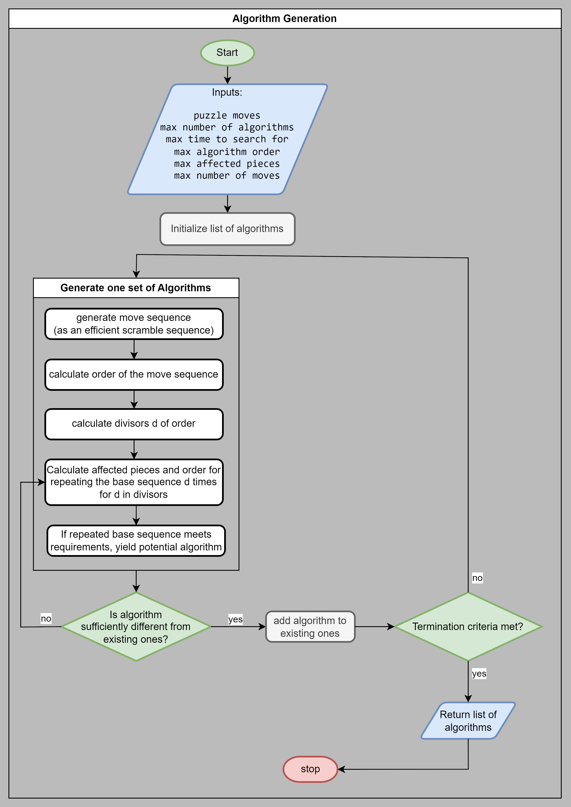

# Algorithm Generation

One of the core contributions of this work is the automatic generation of algorithms for twisty puzzles. We define algorithms as sequences of base moves, that fulfill certain criteria:
- they affect only _few_ puzzle pieces (meaning of _few_ depends on the puzzle, more on that later)
- they have low order (usually < 6)
- they are not too long (< ~200 moves)
- they are reasonably easy to memorize for humans (< ~20 moves before repeating a pattern)

## How to generate algorithms
1. generate move sequences with a few base moves
2. find useful numbers of repetitions for these base move sequences, exploiting the permutation group structure of the puzzle
3. filter out move sequences that are too long or affect too many pieces  
   What remains are potentially useful algorithms.
4. filter out overlap with previously generated algorithms or refine the existing ones  
   We don't want to generate the same algorithm twice, as it would be a waste of resources to train an RL agent to use the same algorithm in two different ways.
5. reapeat 1-4 or stop generating new algorithms

### 1. Generate move sequences
To generate the base sequences, we utilize the `smart_scramble` function: This avoids
- sequences passing through the same state twice
- reduces number of moves by replacing moves with their inverses when beneficial

### 2. Find useful numbers of repetitions
Given a base sequence $s$ with cycles $c_i$, we are looking for numbers of repetitions $k \in \mathbb{N}$ such that $s^k$ affects fewer or the same number of pieces as $s$. To achieve this, $k$ must be a multiple of a cylce's order $ord(c_i)$ for at least one cycle. Then the order of $s^k$ is $ord(s)/k$ and any points that were affected by $c_i$ will remain unaffected by $s^k$.

We also know that $k\leq ord(s)/2$ must hold, since any larger $k$ would not divide $ord(s)$, leading to unnecessarily long algorithms. Due to the finite order of s, it holds that $s^k = s^{ord(s)-k} \,\, \forall k \in \mathbb{N}$. Therefore any $k > ord(s)/2$ can be replaced by $ord(s)-k$ without changing the resulting permutation.

This way, we can efficiently find promising algorithm candidates and predict their effect on the puzzle. We could even specifically search for algorithms affecting given pieces, by considering repetitions of the base sequence that keep other pieces fixed.

Given a list of points that we want to affect with an algorithm and a base sequence $s$, we could find all cycles $c_j$ of $s$ that affect other points (let $I$ be the set of these indices). Repeating $s$ $lcm(\{ord(c_j) | j \in I\})$ times, ensures that only the desired points are affected by the resulting algorithm.
When searching for algorithms affecting specific points, we can also limit the search space for base sequences to include at least one move $m$ affecting each of the desired points, and at least one other move $m'$ that intersects with $m$. Without these conditions, the resulting algorithms would never affect the desired points in a meaningful way.

### 3. Filter out long or too complex algorithms
We want to avoid generating algorithms that are too long as they would be difficult for humans to execute reliably on physical puzzles.

We also want to limit the number of pieces affected by an algorithm, to make it easier for humans to predict their effect and for RL agents to get dense rewards. Algorithms that affect  many pieces can cause large jumps in the agent's reward, which can lead to deep local optima, which inhibit learning (demonstrated by greedy solver getting stuck).

After this step, we consider any remaining repeated move sequences as useful algorithms. To build up a diverse, useful set of algorithms with which to solve the puzzle, we 

### 4. Filter out overlap with existing algorithms
Finally, we want to avoid generating the same or very similar algorithms multiple times. This would be confusing for humans and slow down learning for RL agents by bloating the action set.

Given a new algorithm $a$, a set $A$ of existing ones and a set $R$ of spatial rotations of the entire puzzle, we consider a few cases:
1. Does $a$ have the same permutation as any $a' \in A$ or any spatial rotation $r \circ a' \circ r'$ with $a' \in A, r, r' \in R$?  
   - If yes, compare the number of moves required by both algorithms. Keep the shorter one, discard the longer one.  
        If they are the same length, we could decide based on which base moves are used, or the length of the base sequence (analogous to the number of repetitions).  
        Afterwards, we can move on to generating new algorithms or stop generation.
2. if $a$ or any rotation of it are not in $A$, we can check if algorithms in $A$ are similar to $a$, by investigating the order as well as number and types of affected pieces. For this purpose, we propose an algorithm signature, that can be used quickly tell algorithms apart or detect similarity. (see `src/algorithm_generation/algorithm_analysis.py` and `algorithm_signature_planning.pdf`. For an outdated earlier version, see `algorithm_analysis.md`).  
This algorithm signiture is not sufficient to reject an algorithm based on matching signature though. A puzzle could have two disjoint orbits of pieces that are otherwise identical (e.g. the "left" and "right" edges of a 4x4x4 cube. If these were in different orbits, an algorithm signiture would not be able to tell them apart. Therefore, we must allow saving these.  
However, saving algorithms with similar signature is problematic. For example, there are at least 36 unique  3-cycles of edges on a 3x3x3 rubiks's cube, that are in different equivalence classes under whole cube rotations. On a Megaminx, this number would be much larger. We don't want to store an algorithm for each one of those as it would bloat the action set for RL agents and inhibit learning in that step.  
Leaving out the RL aspect and just using a greedy solver with many algorithms could work, but then large nxnxn puzzles, particularly many faced ones like dodecahedron shaped ones, would have enormous action sets, even with very tight restrictions on the number of pieces affected by an algorithm.  
___So we cannot ignore algorithms with similar signature but we also cannot store all of them.___  
**Solution:** prune the action set once a sufficient one is found. Probably using orbit information.

See also: `algorithm_filtering.md`

### 5. Repeat or stop generating new algorithms
Deciding when to stop generating new algorithms is a difficult problem. Experiments with the greedy solver have shown that having only some algorithms available

## Algorithm Generation Flowchart
<!--  -->
<!-- smaller html image: -->

## Ideas for advanced algorithm generation
### 1. Dynamic algorithm generation based on greedy solver
Part 2 of this method describes how to find algorithms targetting specific points. This could be used to dynamically find algorithms solving the puzzle in steps.

At first, find any algorithm. Then, over many scrambles and greedy solves optimizing the reward function, we can differentiate pieces that can be solved with the exisitng algorihtms from those that can't. We can then generate new algorithms targetting only the unsolved pieces. This prevents making the action set for RL agents unnecessarily large.

#### Positive effects of this approach

- This allows enables solutions to follow a common strategy used by humans: first solve a few pieces while ignoring the rest, then solve the rest in similar steps, ignoring some others.
This can be useful, as it simplifies the algorithms needed to solve the puzzle.
Example: When we start our solution by solving the corners of a Rubik's cube, we don't have to avoid affecting the edges. We only try to avoid undoing existing progress.

(image taken from [cubelelo.com](https://www.cubelelo.com/cdn/shop/articles/how_to_solve_rubiks_cube_1200x.jpg?v=1669713926), _cropped to remove text_) <!-- TODO: replace with own image -->

- This would solve the problem of having multiple algorithms of different orders affecting the same or similar pieces.

- This technique could provide a good indication when to stop searching for new algorithms: If the greedy solver can solve a high proportion of states, we can assume that the action set is sufficient for the RL agent to efficiently learn a good policy.

### 2. Advanced algorithm generation through conjugation
current algorithm generation cannot easily find some popular algorithms because they don't follow the structure n*(base_sequence). Instead, they are better described by a sequence mAmAm^-2, where A is the base sequence and m is a setup move that gets undone afterwards.

### 3. Advanced algorithm generation by recording piece effects
This idea relaxes the condition on the number of pieces an algorithm can affect.

1. categorize permutations into:  
   a) those that _move_ pieces around the puzzle (cycles go between different pieces)  
   b) those that _rotate_ pieces in-place (all cycles are within a single piece)  
   c) those that both _move_ and _rotate_ pieces
   For each affected piece, store, whether it is _moved_, _rotated_.
2. a new algorithm affecting more than a few pieces can still be accepted, if other algorithms can counteract its side-effects. We may find one algorithm that only rotates pieces in-place and another that moves some while rotating others. In some cases, these could be combined to create a single new algorithm that only moves pieces.  
   Such cases could be identified by checking the classification of each piece affected. The goal would then be to find algorithms that are in categories (a) or (b). For new algorithms in (c), we search through existing algorithms to find a pair that can counteract the side-effects of the new one.

# end condition: Group pieces/ points into orbits.
applies the same for points

using random scrambles, record where each piece can move.
Collect this info into a list of possible positions for each piece. To get more complete information, merge the orbits of pieces as soon as one overlapping position is found. This way, we can find out which pieces can be interchanged and which can't.

This process can be recreated using just algorithms and spatial rotations to measure when we have found sufficiently many algorithms to solve the puzzle without base moves.

Withenough algorithms, it may be feasible, if not advantageous to train an AI using no base moves and instead just algorithms and symmetries.

Try adding a binary neuron: 1 if last action was a spatial rotation, 0 otherwise. Then, punish the agent for using two spatial rotations in a row. (the extra neuron is required for this to remain an MDP).

When calculating piece orbits from algorithms, don't apply rotations as moves but rather wrap algorithms in rotations as conjuggates (e.g. $r^{-1} a r$ instead of $a$). Otherwise, whole puzzle rotations could join orbits that may not be connected when just considering base moves.
It certainly is a problem without symmetry filtering (example: skewb), but with symmetry filtering (see OneNote), it be irrelevant.

## Potential efficiency improvement
We can consider solving the permutations within each orbit as a subproblem, that usually has a much smaller state space than the entire puzzle, but can still be represented the same way: as a permutation group. If we find a set of algorithms that can generate all valid permutations of an orbit, we have solved that subproblem. If we achieve this independently for every orbit, we know that we have found a sufficient set of algorithms to solve the entire puzzle.

This is not guaranteed to work for all puzzles though. It's possible, that for some puzzles and some orbit within them, there is no algorithm (especially not one meeting our other requirements) that only affects pieces in that orbit. Some orbits may always be linked to others and cannot be solved independently. In such cases, checking for the end condition described above would be wasted time.
