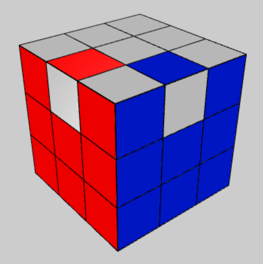

# Intro to Solving Twisty Puzzles with Reinforcement Learning

Twisty Puzzles like the Rubik's Cube (3x3) have been solved with machine learning before.
In 2019, the DeepCubeA algorithm was published by McAleer et al. [[1]](https://doi.org/10.1038/s42256-019-0070-z). In 2023, Efficientcube [[2]](https://openreview.net/pdf?id=bnBeNFB27b) solved the Rubik's cube by learning from reversed scrambles (supervised learning) using much less compute resources.

Both of these ML solutions tend to solve puzzles using as few moves as possible. While this is very efficient, it is very hard for humans to understand how the agent got to this decision. Instead, Humans often use specific move sequences (algorithms) that only change a small pieces of the puzzle at a time. We often use solutions that generalize well for any puzzle state by having move sequences that occur in the solves for many different starting positions.
This project aims to replicate this strategy: Train AIs to utilize algorithms to achieve similar or better performance than without while using much less compute power.

## Motivation - Why Humans solve Puzzles Differently
***Disclaimer:*** This is mostly unfounded speculation by a non-expert (myself). I have not looked up any specific literature on this topic.

Humans have very limited memory dedicated to each puzzle. We do however have a pretty good general world model, being able to recognize many shapes and imagine how certain actions affect various objects.
Based on many other experiences in life, we often use a heuristic: States with many pieces in correct position and orientation are generally more desirable than those with few correct pieces. These states seem closer to the solved state.

## How ML agents solve Puzzles
As indicated before, RL agents are encouraged to find the shortest possible solutions. This is caused by binary rewards and the update in Q-learning.

Given an old Q-function $Q_{old}$, a learning rate $\alpha$, a reward $r(s_t)$, a discount factor $\gamma$, a state $s_t$, an action $a_t$, a new state $s_{t+1}$, the new Q-function $Q_{new}$ is updated as follows:

$$Q_{new}(s_t, a_t) = Q_{old}(s_t, a_t) + \alpha \cdot (r(s_t) + \gamma \cdot \max_{a'} Q_{old}(s_{t+1}, a') - Q_{old}(s_t, a_t))$$

This update rule with a binary reward function (1 if solved, 0 otherwise) encourages the agent to find the shortest possible solution because only the solved state is rewarded. This rewards then propagates back through the Q-function to all other states, being reduced by the discount factor $\gamma$ at each step. So in any state $s \neq s_{solved}$, the action that leads to the solved state the fastest, will have the highest possible reward and thus Q-value.

## So why not change the reward function?

We described before, how humans use estimate closeness to the goal state by counting correct pieces. This would assign a very high reward to states with only two or three incorrect pieces. However, these states are often many moves away from the solved state (see parities on many different cubes and solutions for them [[3]](https://puzzling.stackexchange.com/questions/51661/how-to-flip-adjacent-edges-like-this)).

Overcoming such local optima is already a very challenging problem in machine- and reinforcement learning. This reward function would make it even harder for agents to find a solution due to these many, deep local optima.

## Imitating Human Strategies with RL
Now we have established, that RL agents try to find shortest paths when using binary rewards. However, this proof very much depends on the reward function. Using a different reward function, we could steer the agents towards different behaviour. We can add algorithms to the action set to help these agents get out of the local optima more easily.

We test this approach by randomly scrambling puzzles and plotting the average step-reward after each action, simulating an agent's solves in reverse. This way we can compare different action sets and reward functions.

## References
**[1]**: Solving the Rubik’s Cube with deep reinforcement learning and search. McAleer, S., Agostinelli, F., Shmakov, A., & Baldi, P. (2019). Nature Machine Intelligence, 1(8), 356-363. https://doi.org/10.1038/s42256-019-0070-z  

**[2]**: Self-Supervision is All You Need for Solving Rubik's Cube. Takano, K. (2023). Transactions on Machine Learning Research. https://openreview.net/pdf?id=bnBeNFB27b

**[3]**: puzzling stackexchange example: Edge parity on Rubik's cube. https://puzzling.stackexchange.com/questions/51661/how-to-flip-adjacent-edges-like-this