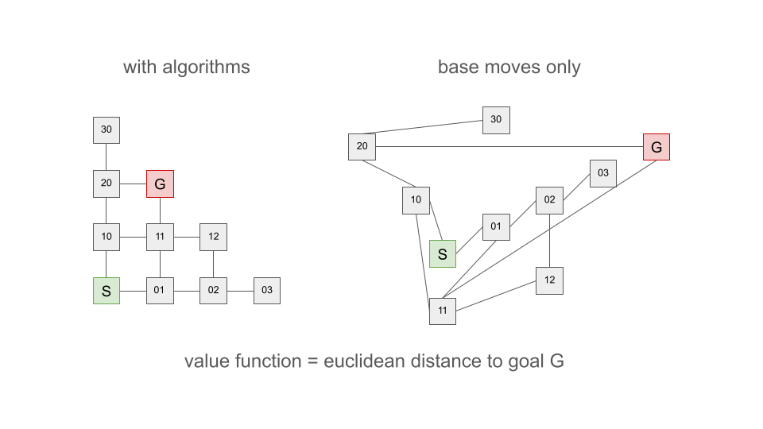

# Smarter twisty puzzle AI

## current AI
Currently the AI gets the state of the puzzle as an input and outputs a single move, that was previously defined by the user.
To learn, the AI tries to solve different scrambles of the puzzle and assigns values to valid state-move pairs via Q-Learning. Currently, these Q-values are stored in a Q-table.

This usually leads to very short solutions but there knowledge of how to solve one state doesn't generalize well to other states.

## How humans solve a twisty puzzle
Humans solve twisty puzzles in a very different way: We develop algorithms (= sequences of moves) that do certain permutations on a small number of pieces, usually without affecting many other pieces.

The development of algorithms is quite difficult and it is very difficult to quantify "small number of pieces" as that can vary drastically depending on the puzzle. (e.g. gear cubes)

But once a sufficient set of algorithms is known, it is quite easy to solve the puzzle from any state. There are three common approaches:
1. solve the puzzle layer by layer. This only works for cuboid shaped puzzles though.
2. solving the puzzle one color at a time.
3. solving the puzzle one piece type at a time. (i.e. first corners, then edges)

Once humans know one algorithm, we can easily exploit symmetries to use it to permute many similar pieces. This generalization is also very difficult for current AIs.

# A better AI

## Problems with the current AI
As mentioned above, the current AI is bad at generalizing information. Every move is only dependend on the current state of the puzzle. The AI doesn't know how to swap two specific pieces, doesn't know any cohesive strategy to solve the puzzle. It mostly relies on brute force, playing millions of games and memorizing which moves were good or bad in each state.

For small puzzles this works fine but this scales quite badly with increases in puzzle complexity. The computational power or time to explore a sufficient percentage of states is not always availiable.

For reference see the state space sizes of some puzzles:

|puzzle name|number of states|number of moves|
|-----------|:------------------:|:-:|
|floppy cube|               $192$| 4|
|ivy cube   |           ~$29.000$| 8|
|Skewb      | ~$3.4 \cdot 10^{6}$| 8|
|rubiks 2x2 | ~$8.8 \cdot 10^{7}$|12|
|rubiks 3x3 |~$4.3 \cdot 10^{19}$|12|
|mixup cube |~$1.9 \cdot 10^{34}$|18|
|rubiks 4x4 |~$7.4 \cdot 10^{45}$|24|
|rubiks 5x5 |~$2.8 \cdot 10^{74}$|24|

With an increase in the number of stickers on the puzzle, the computational effort increases too. This means that given fixed time and hardware, the more difficult a puzzle, the fewer states can be observed. With such a massive increase in state space size, this first AI approach quickly becomes unable to solve the puzzle.

The current approach requires huge amounts of computation power, memory and time.

## Idea of how to improve the AI
Humans have been able to build and solve 17x17x17 cubes, whose state space size is so large, the approach described before would never be able to solve it. So we need to make the AI smarter. We will do this once again by mimicing humans.

### AI Algorithm development
We want the AI to develop its own algorithms (move sequences) and then apply them to solve the puzzle more efficiently.

But this automatic algorithm creation is dificult:
1. What moves do we choose for an algorithm?
2. How can we tell if an algorithm is worth saving?
3. How can we tell if the found algorithms are sufficient to solve the puzzle completely?
4. How can we use the algorithms efficiently without running into the same problems the previous version had?

Why do we expect this to be better?
1. Learning algorithms like Q-Learning often depend on being able to estimate how good the current state is. If only basic moves are available, then there are usually two adjacent states where the one closer to the goal state has more pieces in the wrong positions. This makes an optimal state-value function more necessarily complicated than comparing the current state to the goal state and counting similarities. But such a simple function would be very easy to learn for neural networks.
2. Having algorithms available that only change a few moves, allows for such a simple state-value function to be used together with a greedy search method, making it far easier for an RL agent to learn a generalizable solution.

### Additional improvements
- Instead of online curriculum learning, learn by observing reverse scrambles as shown to be effective in the [Efficientcube paper](https://openreview.net/pdf?id=bnBeNFB27b).
  - improve this technique through scramble shortening  
    measure the effect of scramble shortening to show the importance of quality over quantity of training data
- Improve Search used to solve the puzzle
  - Parallelize search
  - Use better search algorithms (test Beam search instead of A*)
- Empirically test different reward functions and NN architectures on a range of puzzles 

## 1. Generating algorithms

We assume every twisty puzzle has a finite state space size.

If that is the case, every sequence of moves has a finite order, i.e. repeating it often enough will always lead to the initial state again. So once we have chosen a sequence of moves we can repeat it until we get an algorithm that satisfies some conditions we will have to come up with.
Therefore we can choose any sequence of moves as a potential algorithm. We can even try an exhaustive search starting with all algorithms consisting out of two moves, then search all algorithms with three moves and so on.

If the move sequence order $n$ is not prime, but has a factor $q$, we can repeat the move sequence $q$ or $n/q$ times to get a new algorithm of order $n/q$ or $q$ respectively. These may affect fewer pieces than the original move sequence. This way we find algorithms that affect only a few pieces, causing only small changes to the puzzle. This makes it easier to solve the puzzle.

## 2. Requirements for an algorithm

We want algorithms to be ...
1. ... not too short or too long. Usually algorithms should include 4 to 50 base moves. The shorter the better.
2. ... changing few pieces. Ideally an algorithm only changes 2 to 4 pieces. (exceptions for geared puzzles)
3. ... of low order. We want them to both include a small number of turns and have a low order. Usual orders are 2, 3, 4 and 6, as these often represent simple cycles of just a few pieces.

The exact numbers will need to be tested to see which yield the best results. This depends on the puzzle.  
For example on  a gear cube, some useful algorithms affect at least 8 pieces, which would almost always be useless on a 2x2 rubiks cube that only has 8 pieces.

### 2. evaluate algorithms with RLHF
The requirements for algorithms in 2. are quite subjective and difficult to quantify and generalize. Solution idea:
1. write an approximate evaluation function manually
2. train a NN to approximate the evaluation function
3. Use RLHF to fine-tune the NN evaluation function (this likely requires hundreds or thousands of tuning steps)

## 3. When to stop searching for algorithms

Every move is saved as a permutation operating on the puzzle. We can calculate the group generated by those moves.

Since algorithms are also just permutations, we can do the same for algorithms. Once the group generated by our algorithms is the same as the puzzle group, we know that we can solve the puzzle with those algorithms. Otherwise this is not possible.

However for large puzzles the computation of this group may be too timeconsuming itself. As of now I don't understand how these groups are calculated well enough to know the limitations of this method.

There is also the problem that very often it is better to prepare the puzzle for an algorithm or to do single "trivial" moves. But by including the standard moves the criterium doesn't work anymore as it is always fulfilled.

Solution: find algorithms that can solve the puzzle without the base moves, but allow the actor to also use base moves.

## 4. How to use the algorithms

Saving algorithms directly as a sequence of moves isn't necessarily good. As humans we would consider a move sequence $R T R' T'$ to be the same algorithm as $F T F' T'$ (on a standard rubiks cube), just mirrored to act on different pieces. Yet if we only save the algorithm as the exact move sequence, those would be two completely different algorithms.

An alternative approach would be to save *algorithm patterns*. That way we would store the pattern as $A B A' B'$ and then replace $A$ and $B$ with some other moves.  
This raises another problem though: we need to prevent a scenario, where the order of the algorithm changes because of the chosen moves to replace $A$ and $B$ with. For example on a standard rubiks cube, we might get the algorithm $L R L' R'$ with the same pattern as $F T F' T'$, but L and R are disjoint moves, while F and T are not. Therefore $L R L' R'$ is the identity, while $F T F' T'$ is not.  
Here it could be helpful to save relations between moves in the pattern (e.g. relation $A$-$B$), or in more complex algorithms, also between a third move like $A$-$C$, and $B$-$C$ and so on. These relations could be:

1. order of the whole algorithm
2. order of each move ($A$ and $B$)
3. piece signatures affected by each move ($A$ and $B$)
4. number of points affected by each move
5. number of points affected by $A$ and $B$
6. number of points affected by $A$ but not by $B$
7. number of points affected by $B$ but not by $A$

As discussed before we would optimally solve the puzzle through a combination of single preparation moves and algorithms.

Assume we want to apply an algorithm $A$ to the puzzle. To do that we need a certain sequence of preparation moves $M$. What we then actually do to the puzzle would be: $M \circ A \circ M^{-1}$. That way we still get the result from algorithm A but don't make any other changes by reversing the setup moves $M$.

## Problems:
We have two (ML) systems:
1. An actor that solves the puzzle.
2. An algorithm designer that finds algorithms for the actor.

Adding new algorithms to a NN-based actor is difficult. We would need to retrain the NN every time we add a new algorithm, or find a way to add new neurons to the NN without destroying the old knowledge.  
To give the actor a chance at efficient adaptation to new available algorithms, it should also get new inputs, not just new outputs. I do not yet know of any sensible method to communicate what an algorithm does to the neural network though.
Solutions may require a major redesign of the NNs architecture and inputs.