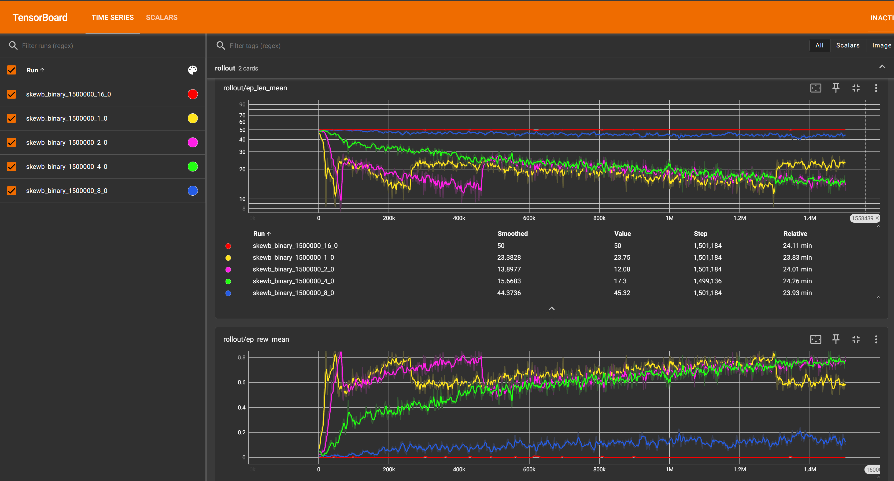

# Training parameters for NNs

### `initial_scramble_length` (Default: 1)
During training, puzzles are randomly scrambled for each episode with the agent's goal being to solve the puzzle. This parameter determines the number of scrmable moves at the beginning of training.
The scramble length is then automatically increased by 1 every 1000 episodes if from the last 500 episodes, the agent's success rate was greater than `success_threshold`.

Experiments training Agents to solve the Skewb have shown that `initial_scramble_length` = 1 yields the best results. Too high values completely prevent the agent from learning anything (when given binary rewards) as it almost never encounters a positive reward Using HER or denser rewards may allow for higher values of `initial_scramble_length`, but setting it to 1 has almost no disadvantages known to us.

Even compared to initial scramble lengths 2, 3 and 4, the agent trained with `initial_scramble_length` = 1 learns faster and achieves higher difficulties (higher `scramble_length`) earlier - presumably because it initialy has more successfull episodes and thus gets less noisy rewards early on. Later, this benefits the agent as it had time to better learn to solve the states close to the goal, so in new states it can more easily find a path to states from which it knows a solution.

### `success_threshold` (Default: 0.8)
Determines how many of the past 500 episodes must have been successful to increase the scramble length by 1.

There is an interesting analogy to teaching in schools with this parameter. It acts similar to a grade a student needs to pass a course or school year to then learn new material in upcoming courses.

### `max_moves` (Default: 50)
The maximum number of moves the agent can make before the episode is terminated.