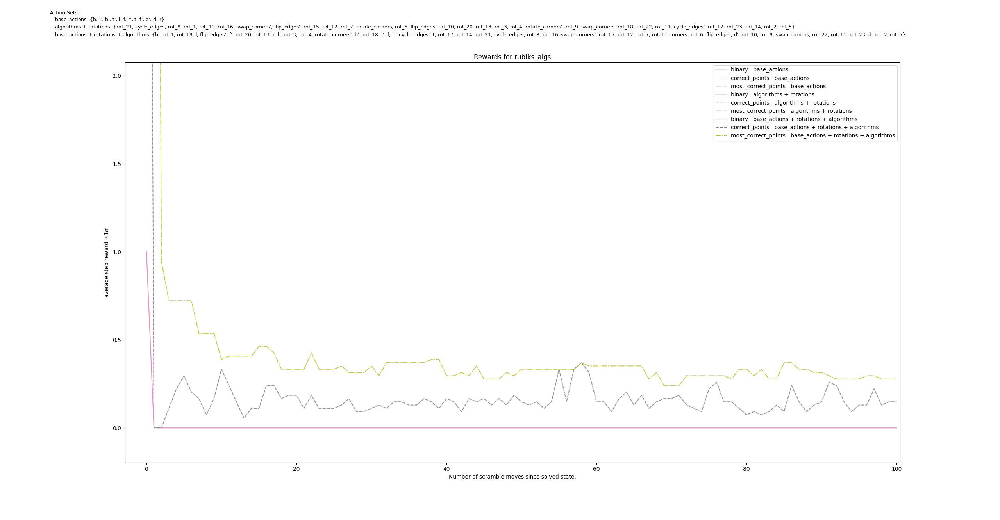
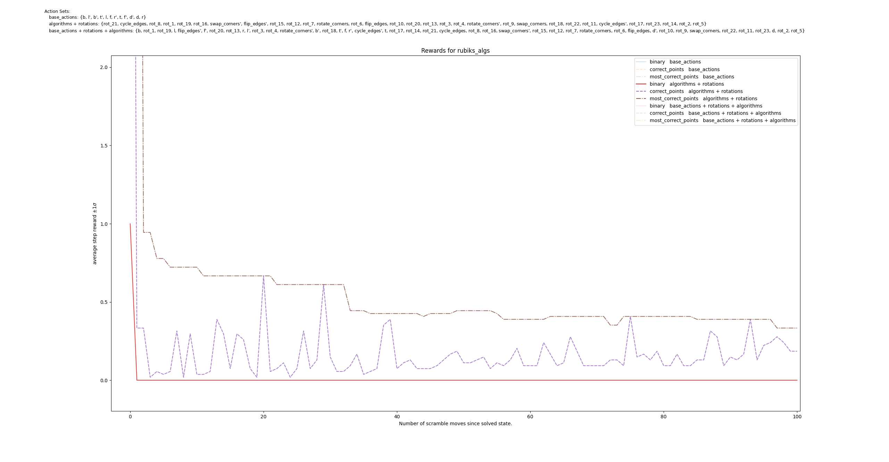
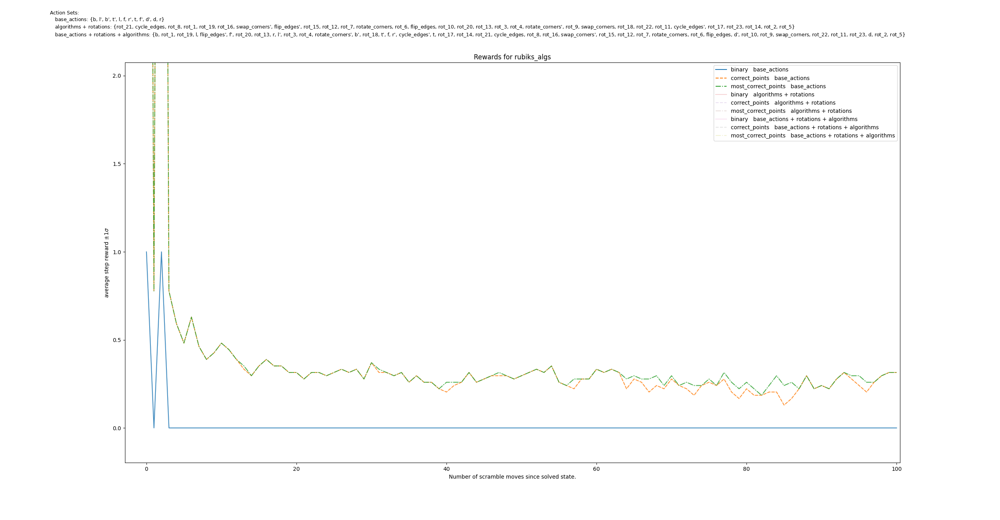
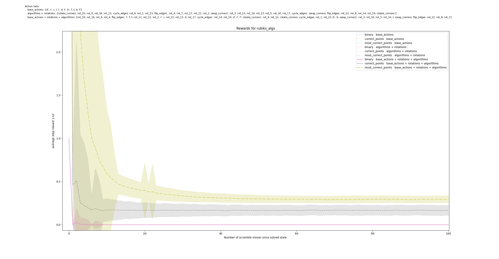
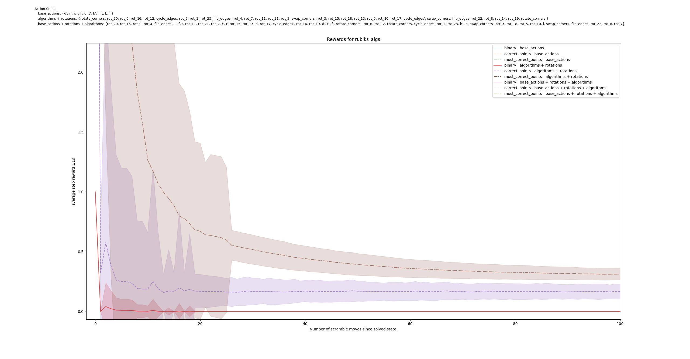
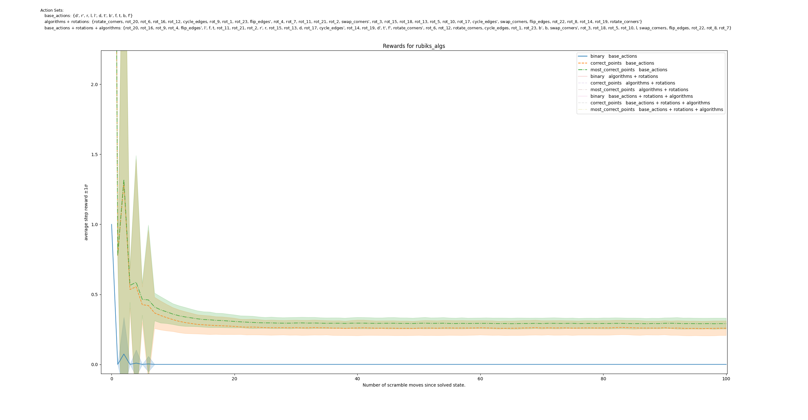
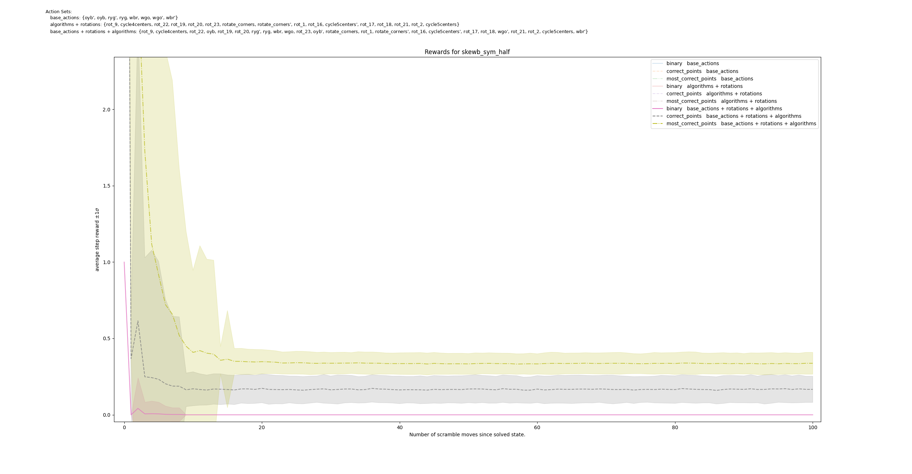
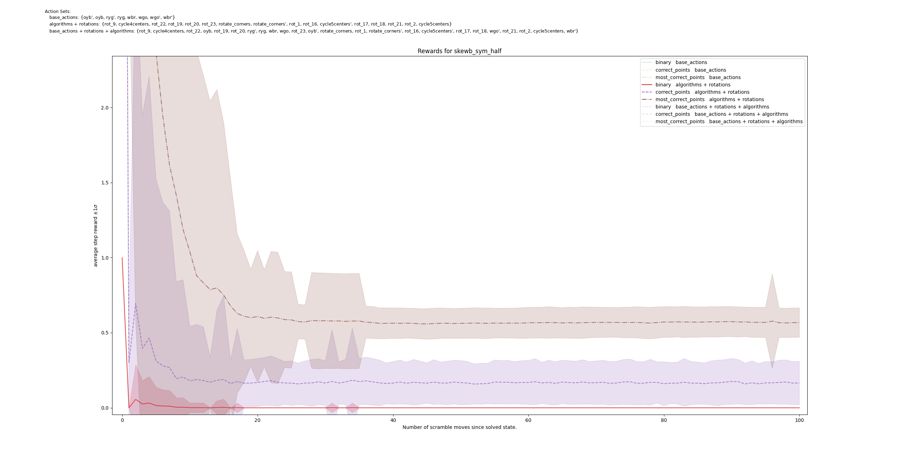
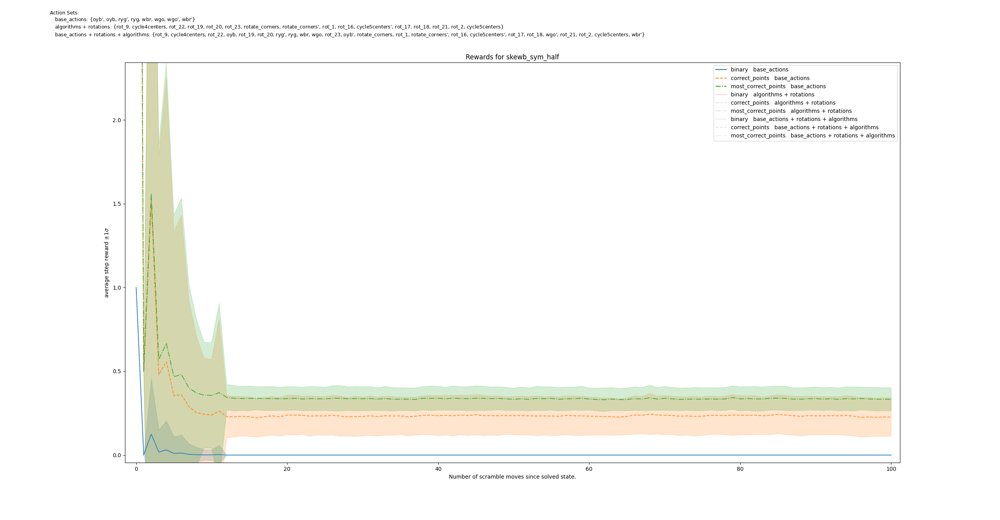
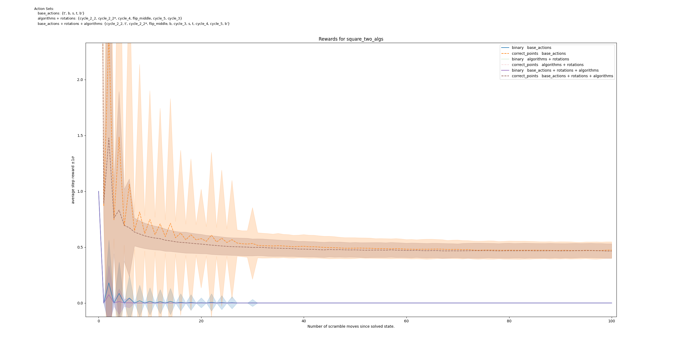

# Reward Analysis for RL-Agents solving Twisty Puzzles

Investigate the influence of:
- different reward functions
- different action sets
- different solution strategies (simulated by different scrambling functions)

1. Scramble the puzzle randomly from a solved state using a given action set.
2. After each move, record the value of the reward function.
3. Repeat for many scrambles, averaging the rewards across all scrambles.
4. Plot the average reward after n moves
5. Show the standard deviation of the reward after n moves.

## Results

### Setup and Parameters
We investigate 3 different action sets, reward functions and puzzles:

**Puzzles:**  
- 3x3 Rubik's Cube
- Skewb
- Square-2

**Action Sets:**
- All moves (base moves, spatial rotations and algorithms)
- Algorithms + Spatial rotations
- Base moves (only the basic moves)

With a well chosen set of algorihtms and rotations, these action sets should all generate the same state space.

**Reward Functions:**
- Binary 0-1 Reward (1 if solved, 0 otherwise) -> `binary`
- Number of Correct Points (how many pieces are in the correct position and orientation) -> `correct_points`
- Rotation invariant number of correct points (early stopping if the current state matches any orientation of the solved state) -> `most_correct_points`

The latter two reward functions assign a reward 10 to the solved state (or its rotations in the case of `most_correct_points`) and a reward between 0 and 1 equal to the proportion of correct points.

We choose 1000 random scrambles for each puzzle and evaluate each reward function on the same scrambles.

### Plots
#### 3x3 Rubik's Cube single scramble
First, we show a single scramble, before showing the average and standard deviation of the reward over 1000 scrambles.

_TODO: add exact scramble moves for single scramble diagrams._  
_TODO: add images of solved and final scrambled puzzle for single scramble diagrams._  

#### 3x3 Rubik's Cube

#### Skewb

#### Square-2
Here, we only show one graph, since the puzzle has very few symmetries that can be exploited. Therefore the action set does not include any spatial rotations. This also means that there is no difference between the two reward functions `correct_points` and `most_correct_points`.

It is likely, that the algorithms without base moves wouldn't be sufficient to solve this puzzle. Therefore these lines are not shown in the plot.

### Observations and Discussion
We observe very similar behaviour across all three puzzles, so we will only describe this once.

In all cases, `most_correct_points` yields a higher reward than `correct_points`. This is expected, since the solved state considered by `correct_points` is also considered by `most_correct_points`. However, the `most_correct_points` reward function also considers all other orientations of the solved state, which can lead to better alignment with the current state and thus a higher reward.
The `binary` reward function almost always yields reward 0, only deviating when the puzzle is solved.

**Single Scramble**  
Looking at a single scramble for the 3x3 Rubik's Cube, we see clearly how `most_correct_points` along with added algorithms removes many non-monotonic jumps in the reward function. Without base moves, it achieves monotonic behaviour for 50 moves. `correct_points` on the other hand is highly non-monotonic and fluctuates a lot across all action sets and scramble depths. When considering only base moves, both functions are almost identical as explained below.  
While the binary reward function doesn't fluctuate at all, since all non solved states are rewarded 0, it also contains very little information for the agent to learn from.

Repeating this experiment for different scrambles, we see very similar reward behaviour almost every time.

**Convergence of Reward**  
After a certain number of scramble moves, all reward functions converge to a constant value. However, this value is reached after a different number of moves depending on the reward function, action set and puzzle. This suggests that the puzzle is fully scrambled and maximally distant from the solved state according to the reward function.

The reward functions should guide the agents towards the solved state. A function providing a monotonic and steady increase in reward is likely to be more useful for training agents than a function that only provides a reward at the end of the episode.

We observe, that `most_correct_points` reaches convergence much later than the other reward functions. This suggests that the reward function is more informative and can guide the agent much earlier during a solve. it also shows less fluctuation in the reward values, suggesting a more monotonic increase in reward.  
Considering the much larger fluctuation of `correct_points` in the single observation presented before, the earlier convergence can also be caused by the fluctuations averaging out over many scrambles. The much smoother `most_correct_points` reward function follows a similar gradual decline of reward with more scramble moves almost every time, leading to random deviations showing up much later, averaging out to a constant average reward later.

**Effect of Algorithms**  
Including algorithms along with or instead of base moves significantly increases the number of steps before convergence is reached, suggesting, that the agent can take smaller reward steps towards the solved state.

This is likely because algorithms typically affect fewer pieces than base moves, thus leaving more of the puzzle in a solved state for longer.

<!-- Using only base moves to solve the puzzle often requires moving many pieces away from their correct positions, which leads to a smaller reward. This also typically changes more pieces at a time than an algorithm does. Both of these effects contribute to the slower convergence of the reward function. -->

Across all action sets, we see a much larger standard deviation in the beginning of the scrambles. This is caused by randomly generated move sequences that can lead back to the solved state. This is much more likely in the beginning of a scramble then after many moves since random moves will generally move the puzzle further away from the solved state. Since the solved state gets a significantly larger reward than other states, this affects the standard deviation of the reward function. The spikes that only occur for `most_correct_points` indicate, that a spatial rotation of the solved state was reached, which is not rewarded by the other reward functions.

**Base Actions only**  
When the action set only contains base moves, `most_correct_points` and `correct_points` are almmost identical. This is likely because the puzzle is always scrambled starting from the exact same solved state. Since no rotation moves are included in the action set, the puzzle cannot quickly be rotated to a different orientation, so that the closest orientation to the solved state is always the same as the one solved state considered by `correct_points`. We might see a difference for puzzles like a rubik's 2x2 where a few base moves can be combined to rotate the puzzle in space.

### Conclusion
The experiments confirm the expectation that the includsion of algorithms as actions and and a rotation-invariant reward function can lead to very dense, close to monotonic rewards.  
We expect, that such an almost monotonic reward function is much more useful for training agents than a sparse reward function that only rewards the solved state. While agents trained on sparse, binary rewards favour the shortest path to the solved state, these dense rewards could be used to guide the agent towards longer solutions using algorithms and thus more generalizable solution strategies.
