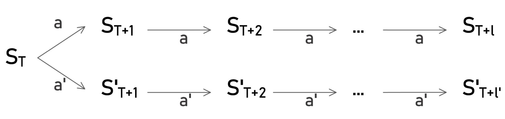

# Analysing a Q-table for twisty puzzles

We want to get an idea of the values in a given Q-table by plotting the average value for different numbers of scrambeling moves (= difficulty levels)

## $n$-dimensional random walk

For most twisty puzzles the number of moves a given state is away from a solved state, under an optimal strategy, is unknown. But we can estimate this distance by interpreting a random scrambling process as an $n$-dimensional random walk, where $n$ is the number of availiable moves in each state.

That way we get an approximation of how far each scrambled state is from the solved state and can then calculate the average Q-value of all moves availiable in that state.

We know that the distance of a random walk to the origin is approximately $\sqrt{k}$ after $k$ steps. As the number $n$ of dimensions increases, the deviation from that $\sqrt{k}$ function decreases and it becomes less likely to return to the origin.

Since we are mostly interested in rather complex twisty puzzles which usually have at least 8, often 12 or more moves, it should be accurate enough to just use $\frac{k}{\sqrt{k}}$ as an approximation for the number of moves a scrambles state is from the solved state after $k$ moves.

## Limitations

Obviously this approach has some major issues:

### 1. cyclic moves
Consider a floppy cube. There are only $4$ possible moves, each with order $2$. That means that if a random walk would choose the same direction twice in a row, the corresponding moves wouldn't change the puzzle at all.

This could probably be counteracted by calculating the order $\deg(a)$ of each move and detecting if a move is chosen $\deg(a)$ times in a row. If that's the case, the approximate distance from  the origin is decreased accordingly.

Similarly, if inverse moves exist in the puzzle, if a move $a$ is chosen $l$ times in a row, the distance from the origin should only be increased by $\max\{l, \deg(a)-l\}$ as the inverse move can achieve the same state quicker. (*)

## (*) replaceing a sequence of moves with inverse moves

Assume we are currently (time $T$) in state $S_T$ and perform action $a$ with order $n_a$ exactly $l$ times with $l \geq \frac{n_a}{2}$, arriving at timestep $T + l$ and state $S_{T+l}$.

Then we can replace the last $l$ moves with the $l' := n_a - l$ inverse moves $a'$, shortening the scramble by $l - \frac{n_a}{2}$.

When doing this we explore different states: 

The sets of states $\mathcal{S'}:=\{S'_{T+1}, ..., S'_{T+l'-1}\}$ and $\mathcal{S}:=\{S_{T+1}, ..., S_{T+l-1}\}$ are disjoint. That means that the states $\mathcal{S'}$ generated from the inverse moves are new in that place of the scramble.
However it ***is*** possible that a state from $\mathcal{S'}$ was visited before $S_T$.

So when recalculating the state history after replacing the $l$ moves $a$ with $a'$, it needs to be checked that the new states $\mathcal{S'}$ are not yet in the state history. Otherwise appropriate shortening may be required.

This potential shortening is the reasen why above we choose to replace moves when $l \geq \frac{n_a}{2}$ and not when $l$ is strictly greater than $\frac{n_a}{2}$.
However this choice causes the danger of resulting in an infinite loop of replacing $l$ moves $a$ with $l$ moves $a'$, but since this doesn't change the length of the scramble, we can still use the length as a break condition and should never end up in an infinite loop.