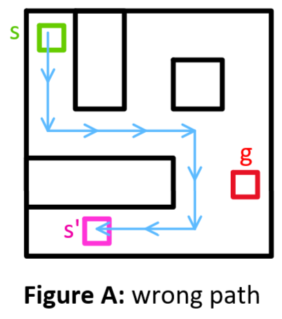

# HER for twisty puzzles

HER = **H**indsight **E**xperience **R**eplay is a method in reinforcement learning that focusses on learning from positive experiences rather than negative ones.

Let ***g*** be a goal state and ***s*** be a starting state. The Agents plays the game starting in state ***s*** with the goal to get to state ***g***. If it manages to get there, we use a standard reward-based algorithm to update the weights for all states visited inbetween.

If the agent does not get to the goal state ***g*** but instead ends up in state ***s'***, usually one defines a negative reward associated with failure, which is assigned to all terminal states ***s'*** except ***g***. However this can lead to problems. Consider the following example:

---
### Example: Maze
| | |
--- | ---
Task: | Go from green to red without crossing black lines
Actions: | up, down, left, right
Terminal state: | red
Secondary terminal conditions: | maximum number of steps taken.

---

Here obviously the first few steps get us very close to the goal ***g***. Assigning a negative reward could prevent the agent to take this path in the future.

HER tries to improve this reward assignment by redefining the goal before assigning rewards. This requires the goal to be an explicit input though, that is saved in the state.
This can increase the complexity of the state significantly.

In this new state representation every action sequence can be rewarded because the final state is always considered to be the goal, making the agent learn from every episode, even if it did not reach the actual goal. 